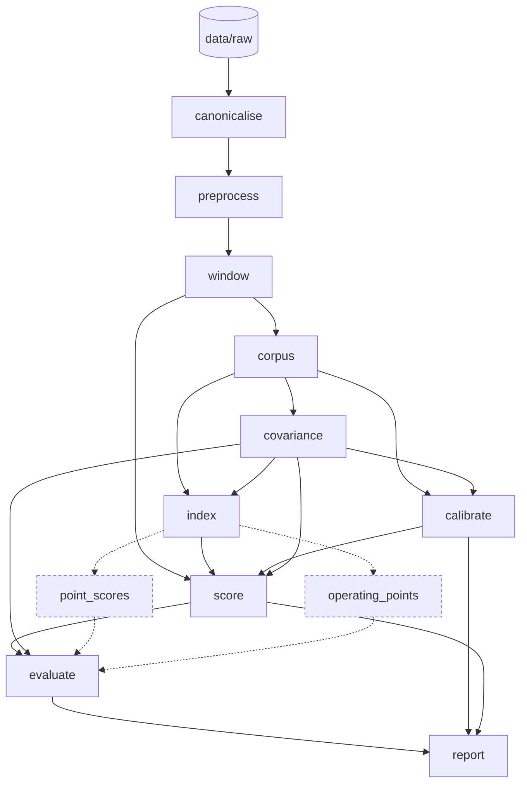

# anomalies-at-scale

Anomaly detection on multivariate sensor streams using path signatures, a Mahalanobis metric and
nearest-neighbour search — built as a reproducible Snakemake pipeline rather than a notebook.

## What it does

Given a corpus of streams assumed normal and a set of streams to score, the pipeline has two arms:
One handles intra-stream anomalies, another tests whether an entire stream is anomalous, but makes no
attempt to identify which section is anomalous.
The first cuts each stream into fixed windows, computes the path signature of every dyadic sub-interval, fits a
Mahalanobis metric to that corpus, indexes it with FAISS, calibrates a per-depth threshold by
cross-validation over streams, and then searches to find anomalies: the whole stream
is tested, whatever fails is bisected and retested down to a resolution floor, and what is
reported is the complement — the points no clean interval covers.
The second proceeds identically over streams of a fixed width, but only performs the whole steam check - no bisection.

## Install

```bash
conda env create -f environment.yaml
conda activate anomalies-at-scale
```

## Run

```bash
python score_streams.py                                  # whole pipeline, all cores
python score_streams.py --dataset cmapss_fd002 --cores 4
python score_streams.py --set detect.method=isolation_forest --dry-run
python score_streams.py --summary                        # last run's results
```

`score_streams.py` is a front door to the Snakefile, so it cannot disagree with the workflow.
`--set` takes dotted keys (`--set detect.neighbours=3`) and reads values as YAML, so `3` is an
integer and `null` is None.

## Pipeline


To render a graph of active pipeline stages

```bash
python score_streams.py --rulegraph | dot -Tpng > dag.png    # needs Graphviz
```

Every stage carries a `benchmark:` directive, and `evaluate` pairs those timings with the counts
they bought — corpus intervals, signature terms, interval queries, points scored — so the summary
reports throughput alongside accuracy.

## Data

`data/` is not tracked. C-MAPSS comes from the NASA Prognostics Data Repository (Turbofan Engine
Degradation Simulation, the `FD001`–`FD004` files); place `train_FDxxx.txt` and `test_FDxxx.txt`
under `data/raw/{dataset}/test/` and `data/raw/{dataset}/corpus/` respectively. SMD comes from OmniAnomaly 
and Exathlon data originates from the orignal Exathlon repository and TimeEval.

> **Note the halves are swapped.** The corpus of normality is built from `test_FDxxx.txt`, whose
> engines are truncated before failure, and the scored set is `train_FDxxx.txt`, which runs to
> failure. <!-- TODO: confirm the download URL you used -->

## Configuration

Everything lives in `config/config.yaml`, which documents each setting and the measurements
behind its default. The keys that change the most:

| key | what it does |
| --- | --- |
| `signature.trunc` | truncation level; dimension grows like `width ** trunc` |
| `window.size` | increments per window, a power of two |
| `detect.method` | `mahalanobis` or `isolation_forest` |
| `detect.neighbours` | which neighbour's distance is the score |
| `detect.bagged.draws` | feature bagging across random channel subsets; `-1` is off |
| `evaluate.metrics` | whether the detector is scored against labels at all |


## Layout

```text
Snakefile              the workflow
score_streams.py       command-line entry point
config/config.yaml     every setting, with the evidence for its default
src/anomalies_scale/   the modules each stage calls
notebooks/             notebook experiments

## Licence

MIT — see [LICENSE](LICENSE).

This covers the code in this repository. The datasets it runs on are not included and carry
their own terms: C-MAPSS is public NASA data, and Exathlon is CC BY-NC-SA 4.0.
